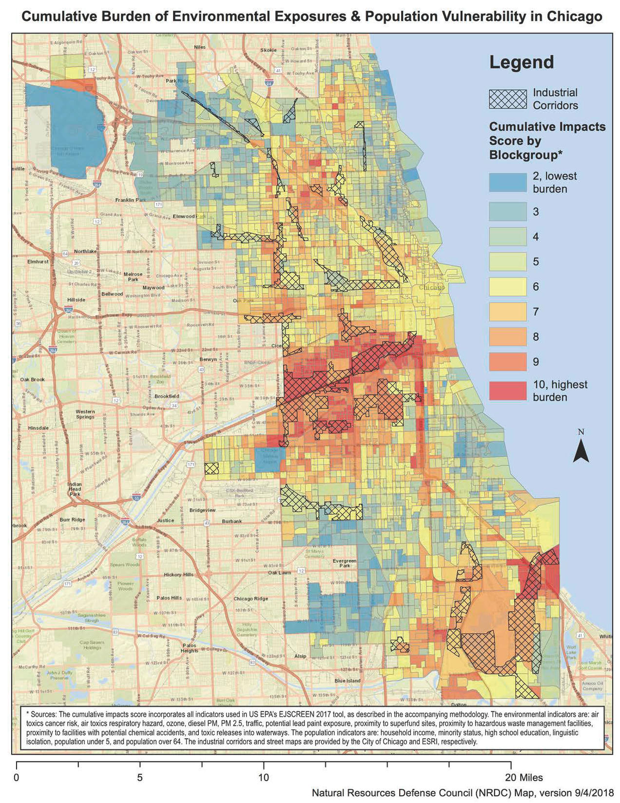
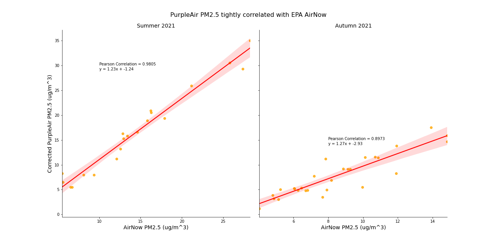

# Neighborhood-level Air Quality Metrics

## Overview
This is an internal incubator project for the [Code for Chicago](https://codeforchicago.org/) Brigade. The project seeks to explore data-driven solutions for local environmental groups. 

Current Chicago-area Air Quality Index (AQI) measures, which help people determine how safe the air is to breathe on any given day, are based off of nine EPA sensors located largely in the suburbs surrounding Chicago ([see sensor map](#airnow-sensor-map)). We hypothesized that these suburban-located sensors may not accurately represent air quality in more urban and industrial neighborhoods.

This would imply:
- Policy is designed based on incomplete information
- Some populations may lack appropriate air quality warnings
- A greater investment in sensors may be needed

|  |
| :---: |
| [2018 Natural Resources Defense Council](https://www.nrdc.org/experts/meleah-geertsma/new-map-shows-chicago-needs-environmental-justice-reforms) shows that air pollution exposure risk is not evenly spread across greater Chicago area.

## Approach
To test this hypothesis, we decided to compare particular matter concentrations (PM2.5) from the EPA to low-cost local sensors (PurpleAir) in the McKinley Park neighborhood of Chicago. McKinley Park was chosen as an example because it is a more industrial neighborhood near central Chicago which already had at least three PurpleAir sensors. Because air quality fluctuates over time and typically becomes worse in the Summer months, we compared seven weeks of data from Summer and Fall of 2021.


Our baseline AQI data was pulled from five EPA sensors in the Chicago area using the AirNow API. These five were chosen because they had PM2.5 data. For localized air quality data, we gathered PM2.5 readings from three PurpleAir sensors in the McKinley Park neighborhood using the Thingspeak API, which stores open PurpleAir data. Three weeks of readings were gathered from July 2021 and another four weeks from October 2021. These readings were then averaged to daily readings for Chicago (EPA) and McKinley Park (PurpleAir). It was discovered that PurpleAir sensors are consistently high in their PM2.5 readings, particularly in high humidity environments. To correct for this, we used the sensors’ humidity readings to adjust the data using an EPA correction formula.

## Key Findings
We found that even after applying the EPA correction factor for PurpleAir sensors, the air quality is consistently worse in McKinley Park compared to the greater Chicago area readings from the EPA’s AirNow. This is especially true in the Summer months. However, PM2.5 pollution was not high enough to consistently change the AirNow AQI warning. For this reason, we believe that localized air quality measures using affordable sensors is a better way to measure the local pollution concentrations, but that area-wide AQI warnings likely serve as a good indicator of general air quality trends. 

|  |
| :---: |
| PM2.5 concentration is consistently higher in McKinley Park than EPA reportings, especially in Summer |


## AirNow Sensor Map

|  |
|: --- :|
|The map above highlights the lack of official air quality sensors in more urban and industrial areas<br>of Chicago. *This map can be created by running [src > visualization > map_airnow_sensors.py]('src/visualization/map_airnow_sensors.py')*|


## Getting Started
If you wish to run the analysis for your local neighborhood, follow these steps:

1. Clone the repository.
1. Set up a local environment using the `requirements.txt` file.<br />
    `pip install -r requirements.txt`
1. Obtain an EPA AirNow API key [here](https://docs.airnowapi.org/account/request/) and a PurpleAir API key by emailing contact@purpleair.com
1. Create a file called `.env` in the root directory. This file is ignored via the `.gitignore` file to avoid committing secrets.
1. Open `.env` in a text editor and add the following as the contents, replacing the second part with your personal API key:
```
EPA_KEY='REPLACE_ME_WITH_AIRNOW_API_KEY'
PURPLE_AIR_KEY='REPLACE_ME_WITH_PURPLE_AIR_API_READ_KEY'
```
1. Run [1.0-airnow-data-extraction.ipynb](https://github.com/Code-For-Chicago/Air-Quality/blob/main/notebooks/1.0-airnow-data-extraction.ipynb) and [1.1-purpleair-data-extraction](https://github.com/Code-For-Chicago/Air-Quality/blob/main/notebooks/1.1-purpleair-data-extraction.ipynb) to collect the sensor data.
1. Run [mckinley_park_vs_airnow_accuracy_corrections.ipynb](https://github.com/Code-For-Chicago/Air-Quality/blob/main/notebooks/mckinley_park_vs_airnow_accuracy_corrections.ipynb) with the relevant data to identify the correlation between local and EPA sensors.


## Table of Contents

- **data**: data to replicate the original analysis
- **docs**: project and API documentation, sensor sizing estimates, and background information on air quality and health effects
- **figures**: graphs and images created for the original analysis
- **notebooks**: Jupyter notebooks outlining the original analysis
- **src**: a library of Python functions used in the analysis
- **requirements.txt**: a list of all Python libraries required to run the analysis

## Project Contributors

| Name (GitHub)                                               | Role                                     |
| :---------------------------------------------------------- | :--------------------------------------- |
| Chris Lynch ([TheeChris](https://github.com/TheeChris))     | Project Lead, Analytics, Documentation   |
| Rahul Goel ([rahulgoel97](https://github.com/rahulgoel97))  | Analytics, Documentation                 |
| Joseph Adorno ([JoeAdorno3](https://github.com/JoeAdorno3)) | Literature Review/Research               |
| Nilay Kumar ([nilaykumar](https://github.com/nilaykumar))   | Analytics, Documentation                 |
| Lucia Korpas ([notchia](https://github.com/notchia))        | Analytics                                |
| Joseph Tajaran ([tajaran](https://github.com/tajaran))      | Project Manager                          |
| Rosy Romero                                                 | Project Manager                          |
| Dann Morr ([dannmorr](https://github.com/dannmorr))         | Project Lead emeritus                    |
| Meg Wu                                                      | Student Intern                           |


## Contributing
If you have a feature request or notice a bug, please add an [issue](https://github.com/Code-For-Chicago/Air-Quality/issues). If you would like to contribute to the code base, but are unsure how, please check out the [First Contributions](https://github.com/firstcontributions/first-contributions) repository.
